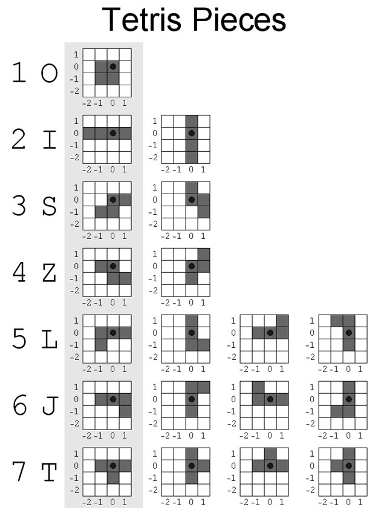

# General Assembly Project 1: Tetris

***Timeframe***

9 days

## Goal:

To create a fully functioning browser-based game of your choice using vanilla JavaScript

## Technologies Used
* HTML5 with HTML5 audio
* CSS3 with animation
* JavaScript (ES6)
* Git
* GitHub
* Google Fonts

# Tetris

This is a 2D, single-player game based on [Math is Fun's implementation](https://www.mathsisfun.com/games/tetris.html) of the classic game Tetris.

### Play deployed version

https://purvitrivedi.github.io/project-one/

## Controls

* Click the Start Button or press spacebar to start the game
* Use the left  (  )  and right  (  )  arrow keys to move Tetriminos left and righ, respectively.
* Up (  ) arrow key rotates the Tetrimino in play
* Down (  ) arrow key accelerates the Tetrimino's downward motion

## Development Process
Out of the options we were given for this project, Tetris ranked as one of the highest in difficulty. 

This made me quite nervous about picking it as my game of choice, however if there was a time to get over any fear of coding, it was right at the beggining! 

I decided that strong, step-by-step planning and a 'calm mindset' would be key to making this project a success.

I also decided to use Objects and Class Methods for this project as this was a weak point in my learning at that time and I wanted to practice it further.

### Day One: 

#### Pseudocoding and Basic Structure

> *Checklist*:
> * Create a 12 x 20 grid
> * Make a colour move left and right
> * Make color move downwards on timer and stop at the bottom
> * Make all tetrimino shape as arrays
> * Start with o-shape: ensure it falls down, moves left & right and, stops at the bottom
> * Do this for all shapes
> * Rotation: Start with l-shape, then move on to others
> * Block cells contain tetriminos
> * Collision Detection
> * Line Clearing once a row is occupied
> * Line dropping and shifting
> * Game over Logic
> * Wall Kicks
> * Score Implementaion & Styling

The 12 x 20 grid was made by creating 240 divs within the main grid wrapper. The 240 divs would be reffered as 'cells' in this README.

Each cell in the was given id it's cell number as this would help in Tetrimino positioning and rotations. The top row was given a class of 'top' for game over logic and every alternative grid was give the class of 'odd' for styling.

The movement of a block is achieved by adding and removing 'occupied' cell class. As the block moves position - the class is removed form the previous cell and applied to the new one. The block falls down on a timer, with the width of the grid added at each interval.

### Day Two: 

#### Making Shapes, Applying Movements to O-shape and using Object class methods

A typical array of tetriminos would look like this - with each value in the array as the starting grid position:

    const oShape = [5, 6, 17, 18]
    const iShape = [5, 4, 6, 7]

With object class methods I would essentialy be applying similar methods to all shapes. Each Tetrimino object had three properties and 2 common methods: 

createShape and removeShape methods would add and remove classNames based on movements:

    class Tetrimino {
        constructor(name, dimensions, className) {
          this.name = name
          this.dimensions = dimensions
          this.className = className
        }

        createShape() {
          this.dimensions.forEach(cell => {
            cells[cell].classList.add(this.className)
          })
        }

        removeShape() {
          this.dimensions.forEach(cell => {
            cells[cell].classList.remove(this.className)
          })
        }

      }

They also had their own movement restrictions based on their shapes.

An example:

    class S extends Tetrimino {
      constructor(name, dimensions, className) {
        super(name, dimensions, className)
      }
      moveTetriminosS(keycode) {
        const x = [this.dimensions[2] % width, this.dimensions[1] % width]
        switch (keycode) {

          case 39:
            this.removeShape()
            if (x[1] < width - 1) {
              this.dimensions = this.dimensions.map(cell => {
                return cell += 1
              })
            }
            this.createShape()
            break

          case 37:
            this.removeShape()
            if (x[0] > 0) {
              this.dimensions = this.dimensions.map(cell => {
                return cell -= 1
              })
            }
            this.createShape()
            break

          default:
            console.log('rotate or move down')
        }
    }

### Day Three & Four:

#### Rotations and random Tetrimino Generation

Most of day three was spend on calculation the axis of rotation for the tetrimino pieces. The guide used for tetrimino rotations is provided below:

Tetrimino Rotation examples are:

    const sShape = [5, 6, 16, 17]
    const sRotate = [0, 0, -23, 1]

    const zShape = [4, 5, 17, 18]
    const zRotate = [13, 0, -11, -24]

Once the rotation calculations were done - each Tetrimino had its own rotation method added to it's inherited class. <code> let rotationNum</code> helped me keep track of how many rotations had been made. For example, S only had two possible rotations, so the <code> rotationNum </code> switched between 0 and 1:

    rotateS() {
          if(Math.min(...this.dimensions) <=11) return
          if(rotationNum === 1) {
            this.removeShape()
            this.dimensions = this.dimensions.map((cell, index) => {
              return cell -= sRotate[index]
            })
            this.createShape()
            rotationNum = 0
          } else {
            this.removeShape()
            this.dimensions = this.dimensions.map((cell, index) => {
              return cell += sRotate[index]
            })
            this.createShape()
            rotationNum++
          }
        }

Once a the Tetrimino would reach the bottom -- which is determined when some of it's cells position is greater than the last second row -- This would trigger the timer to clear. <code>createNewShape</code> function would then be called and this would restart the process again.

    if(Math.max(...makeShape.dimensions) > (cells.length - 13) {
      clearInterval(timerId)
      rotationNum = 0
      createNewShape()
    }

### Day Five & Six:

#### Collision Detection, Line Clearing and Shifting 

Collision detection just needed one more condition to the if statement: top stop the interval once one of the tetrimino cells would contain "occupied" class.

    if (Math.max(...makeShape.dimensions) > (cells.length - 13) || makeShape.dimensions.some(element => cells[element].classList.contains('occupied')))

After this it would call the <code>checkOccupiedCells</code> function that would take the tetrimino above the blocked cells before adding "occupied" class to all of its cells.

The if statement also called the <code>clearLine</code> function which would check if a row of occupied cells had "occupied" class in it. The start of the row would be checked with the if statement below:

    if (blockedArray[i] % 12 === 0)

The "occupied" class would be removed from the eligible row of cells.

The <code>blockedRowsDown</code> function executed Line shifting. It made use of an array of arrays containing occupied cells in each row. While the difference between the two seperate array of occupied cells was more the width + 1, then occupied row would move down.

    for (let i = blockedRowArrays.length - 1; i >= 1; i--) {
         const current = Math.min(...blockedRowArrays[i])
         let previous = Math.max(...blockedRowArrays[i - 1])
         let difference = current - previous
         while (difference >= 13) {
           blockedRowArrays[i - 1] = blockedRowArrays[i - 1].map  (cell => cell + 12)
           previous = Math.max(...blockedRowArrays[i - 1])
           difference = current - previous
         }
       }

### Day Seven, Eight & Nine:

#### Game Over Logic, Wall Kicks
On Day seven, I achieved MVP after writing the game over Logic. I also implemented wall kicks for I and Z shape. 

      const iRotateLeft = [0, -13, 10, 21]
      const iRotateLeftBack = [1, -12, 11, 22]
      const iRotateRight = [0, -11, 14, 27]
      const iRotateRightBack = [0, -11, 14, 27]
      const iRotateTop = [12, 12, 12, 12]

I then focused on implementing a few key extra features and styling

* Implement Keydown feature to accelerate downwards movement 
* Created a score count and start button
* Styling
* Sounds 

## Bugs

* Collision Detection does not work left and right
* Downwards acceleration stops earlier than expected

## Wins

* Got the MVP! 

* Worked with Objects Class methods: I always felt like this was a weak point in my JS learning. I feel a lot more comfortable.

* Styling - quite happy with the floating space look

## Challenges

* Working with Object Class Methods - I learned about Object Mutability, I had to move all methods to inheritated classes so they apply as required.

## Future Content

* Speed increases with score
* Mobile Support
* Wall kicks to work for all tetriminos

## Credits

* Jack May, SEI Instructor for starter code -- which helped in created the 12 x 20 grid.
* [Math is Fun's Tetris](https://www.mathsisfun.com/games/tetris.html)
* [Parallel Tetris research paper by Ayush Jiwarajka](https://people.ece.cornell.edu/land/courses/ece5760/FinalProjects/f2008/aj77/aj77/finalreport.html) for image that guided rotation logic.

